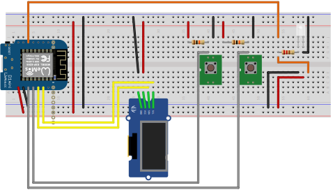

# solar-photovoltaics-charging-controller

Automatically charging an electrical car based on the power in the power storage and how much cames form the photovoltaics.

Different charging modes:

- automatical charging, based on fix values compared with real life values from the power station
- manual charging: startable via a button connected to the WEMOS D1 or via the web interface

