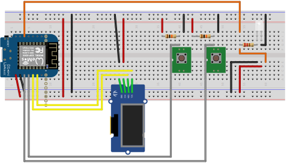

# solar-photovoltaics-charging-controller

Automatically charging an electrical car based on the power in the power storage and how much cames form the photovoltaics.

Different charging modes:

- automatical charging, based on fix values compared with real life values from the power station
- manual charging: startable via a button connected to the WEMOS D1 or via the web interface

## Button usage

- JSON View Button: Press the button and the whole JSON file is displayed on the screen in scroll mode
- Manual Charging Button: Press the button for activating the manual charging mode. Press the button again to change the charging duration (0h, 1h, 2h, 3h, 4h, 5h). If you press 5seconds nothing, than the charging is starting. If you want to stop the charging, press the button again until 0h.

## Web Interface

Open `http://IPADDRESS_OF_THE_WEMOS` and you will see the same thing like on the display. You can also start charging from here.

## Wiring

| Wemos D1 | Device |
|---|---|
| 5V | like in the picture |
| GND| like in the picture |
| D4 | Manual Charging Button |
| D3 | JSON-View Button |
| D2 | SDA-Display |
| D1 | SCL-Display |
| RX |  |
| TX |  |
| RST |  |
| A0 |  |
| D0 |  |
| D5 |  |
| D6 |  |
| D7 | Relay/Led |
| D8 |  |
| 3V3|  |

## Screenshots / Displaypreview

