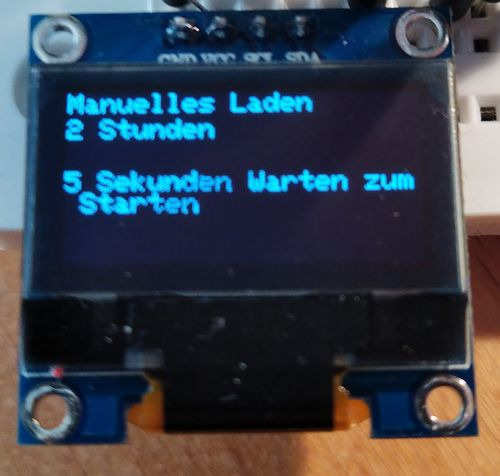

# Automatic car charger (wallbox)

Automatic charging of an e-car based on the data of your sonnenbatterie.

Different charging modes:

- automatical charging, based on fix values compared with live values from your sonnenbatterie
- manual charging: startable via a button connected to the WEMOS D1 or via the web interface

## First start

1. buy all the [components](#hardware)
2. connect all the components like in [wiring](#wiring)
3. upload the compiled binary to the controller [how-to](#flashing-wemos-d1-mini)
4. connect your smartphone with the `Charger Station`, password is `123456789`
5. open `http://192.168.178.4.1/config` and change the wifi and server settings
6. after saving, the controller connects with your wifi and starts running 

## Hardware

| parts | name | url |
|---|---|---|
| 1 | Wemos D1 Mini | [link](https://www.makershop.de/plattformen/d1-mini/wemos-d1-mini-2/) |
| 1 | OLED Display 0,96 Zoll I2C| [link](https://www.az-delivery.de/en/products/0-96zolldisplay) |
| 1 | SPI Reader Micro Memory SD TF Card Memory Card Shield Module | [link](https://www.az-delivery.de/en/products/copy-of-spi-reader-micro-speicherkartenmodul-fur-arduino) |
| 2 | Button| --- |
| 2 | 10k resistor| --- |
| 1 | relay | [link](https://www.az-delivery.de/en/products/relais-modul) |

### Wiring

| Device | Wemos D1 ||| Device |
|---|---|---|---|---|
| like in the picture | 5V |  | RST |  |
| like in the picture | GND |  | A0 |  |
| Manual Charging Button | D4  |  | D0 | LED/Relay |
| JSON-View Button | D3  |  | D5 | SCK-SD |
| SDA-Display | D2  |  | D6 | MISO-SD |
| SCL-Display | D1  |  | D7 | MOSI-SD |
|  | RX  |  | D8 | CS-SD |
|  | TX  |  | 3V3 |  |

## Software

The code is in the `solarcharger` folder. You can modify the code with the [Arduion IDE](https://www.arduino.cc/en/software).

### Flashing Wemos D1 Mini

Install the following tool [esptool](https://pypi.org/project/esptool/) for python: `pip3 install esptool`. Connect the Wemos via USB with this computer. Get the port with `ls /dev/ttyUSB*`. If the controller is connected to `/dev/ttyUSB0` than you can use this command, otherwise you have to change the port in the command:
`esptool.py --port /dev/ttyUSB0 write_flash 0x0000 solarcharger/solarcharger.ino.d1_mini.bin`

## Usage

### Button usage

- JSON View Button: Press the button and the whole JSON file is displayed on the screen in scroll mode
- Manual Charging Button: Press the button for activating the manual charging mode. Press the button again to change the charging duration (0h, 1h, 2h, 3h, 4h, 5h). If you press 5seconds nothing, than the charging is starting. If you want to stop the charging, press the button again until 0h.

### Web Interface

Open `http://IPADDRESS_OF_THE_WEMOS` and you will see the same thing like on the display. You can also start charging from here.

### Configuration

You can either change the configuration via the web interface or if you put the sd-card in your computer and change the settings in the `config.json` file. You find in this repository an default configuration file `config.json.default`

Sections in the config file:

- wifi
  - your wifi connection
- server
  - the server url and authkey for your sonnenbatterie
- local (the default values for checking something)
  - p_auto_w: capacity of your sonnenbatterie
  - timeMinNewJSON: after how many minutes the new values from the sonnenbatterie should be queried
  - timeMinCheckCharging: after how many minutes the controller should check if charging is possible/neccesary
  - displayTime: how long should be the display be on in seconds
- defaultValues
  - for calculation the charging process
- displayJSONvalues
  - all values from the sonnenbatterie request that sould be shown on the oled display when pressing the button
  - possible values: `Consumption_W, FullChargeCapacity, GridFeedIn_W, Pac_total_W, Production_W, RSOC, SetPoint_W, Timestamp, USOC, UTC_Offet, ic_status, DC, Critical, Error condition in BMS initialization, HW_Shutdown, HardWire Over Voltage, HardWired Dry Signal A, HardWired Under Voltage, Holding Circuit Error, Initialization Timeout, Initialization of AC contactor failed, Initialization of BMS hardware failed, Initialization of DC contactor failed, Initialization of Inverter failed, Invalid or no SystemType was set, Inverter Over Temperature, Inverter Under Voltage, Inverter Version Too Low For Dc-Module, Manual shutdown by user, Minimum rSOC of System reached, No Setpoint received by HC, Shutdown Timer started, System Validation failed, Voltage Monitor Changed, Eclipse Led, Pulsing Orange, Pulsing White, Solid Red, Flat Status, Error, Full Charge Power, Full Discharge Power, Not Connected, Spare 1, Spare 2, Spare 3, Timeout, MISC Status Bits, F1 open, Min System SOC, Min User SOC, Microgrid Status, Continious, Discharge Current Limit Violation, Low Temperature, Max System SOC, Max User SOC, Microgrid Enabled, Min System SOC, Min User SOC, Over Charge Current, Over Discharge Current, Peak Power Violation, Protect is activated, Transition to Ongrid Pending, Setpoint Priority, Energy Manager, Flat, Full Charge Request, Inverter, Min User SOC, Trickle Charge, System Validation, Country, Country Code Set status flag 2, Self test Error DC Wiring, Self test Postponed, Self test Precondition not met, Self test Running, Self test successful finished, nrbatterymodules, secondssincefullcharge, statebms, statecorecontrolmodule, stateinverter, timestamp`

## Screenshots / Displaypreview

