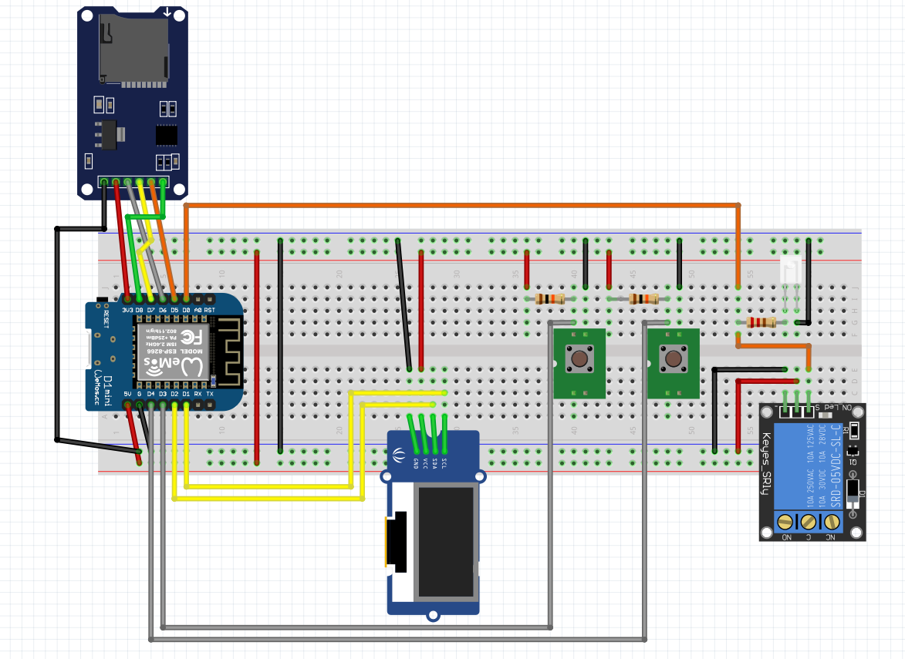

# solar-photovoltaics-charging-controller

Automatic charging of an e-car based on the data of the battery in the house and the current power of the solar cell.

Different charging modes:

- automatical charging, based on fix values compared with live values from the power station
- manual charging: startable via a button connected to the WEMOS D1 or via the web interface

## Hardware

| parts | name | url |
|---|---|---|
| 1 | Wemos D1 Mini | [link](https://www.makershop.de/plattformen/d1-mini/wemos-d1-mini-2/) |
| 1 | OLED Display 0,96 Zoll I2C| [link](https://www.az-delivery.de/en/products/0-96zolldisplay) |
| 1 | SPI Reader Micro Memory SD TF Card Memory Card Shield Module | [link](https://www.az-delivery.de/en/products/copy-of-spi-reader-micro-speicherkartenmodul-fur-arduino) |
| 2 | Button| --- |
| 2 | 10k resistor| --- |
| 1 | relay | [link](https://www.az-delivery.de/en/products/relais-modul) |

### Wiring

| Device | Wemos D1 ||| Device |
|---|---|---|---|---|
| like in the picture | 5V |  | RST |  |
| like in the picture | GND |  | A0 |  |
| Manual Charging Button | D4  |  | D0 | LED/Relay |
| JSON-View Button | D3  |  | D5 | SCK-SD |
| SDA-Display | D2  |  | D6 | MISO-SD |
| SCL-Display | D1  |  | D7 | MOSI-SD |
|  | RX  |  | D8 | CS-SD |
|  | TX  |  | 3V3 |  |

## Software

The code is in the `solarcharger` folder. You can modify the code with the [Arduion IDE](https://www.arduino.cc/en/software).

### Flashing Wemos D1 Mini

Install the following tool [esptool](https://pypi.org/project/esptool/) for python: `pip3 install esptool`. Connect the Wemos via USB with this computer. Get the port with `ls /dev/ttyUSB*`. If the controller is connected to `/dev/ttyUSB0` than you can use this command, otherwise you have to change the port in the command:
`esptool.py --port /dev/ttyUSB0 write_flash 0x0000 charger/charger.ino.d1_mini.bin`

## Usage

### Button usage

- JSON View Button: Press the button and the whole JSON file is displayed on the screen in scroll mode
- Manual Charging Button: Press the button for activating the manual charging mode. Press the button again to change the charging duration (0h, 1h, 2h, 3h, 4h, 5h). If you press 5seconds nothing, than the charging is starting. If you want to stop the charging, press the button again until 0h.

### Web Interface

Open `http://IPADDRESS_OF_THE_WEMOS` and you will see the same thing like on the display. You can also start charging from here.

## Screenshots / Displaypreview

